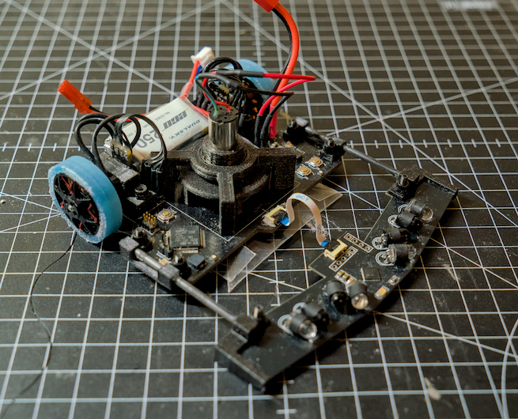
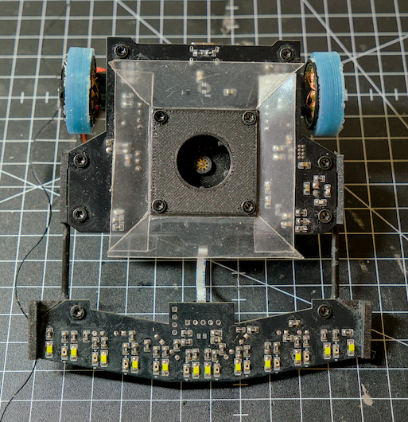
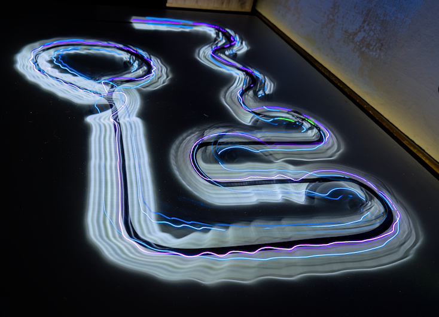
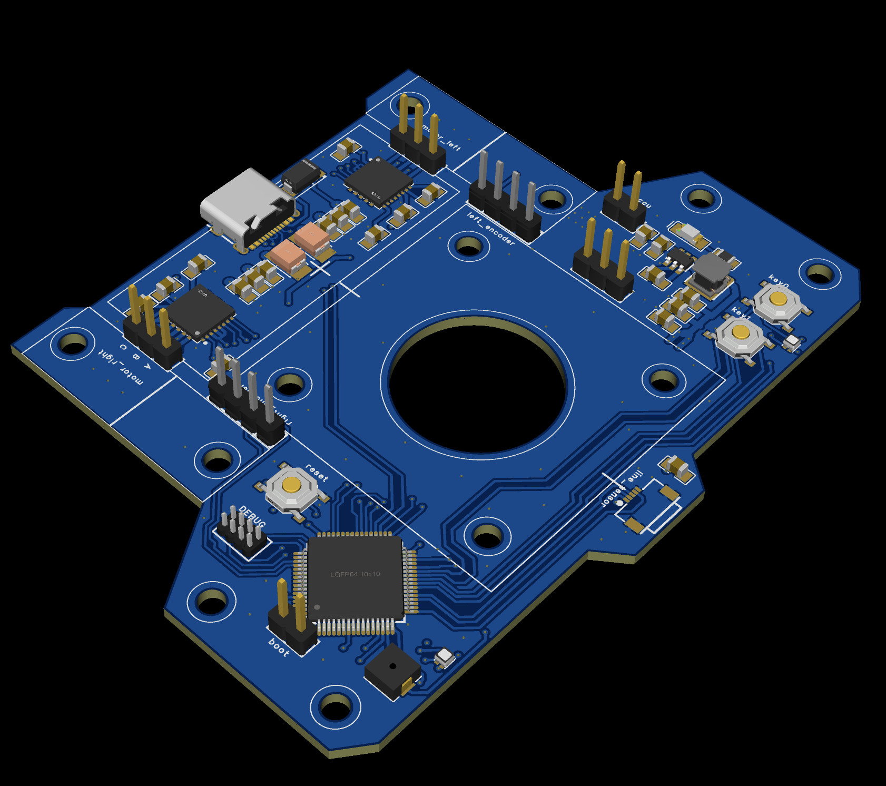
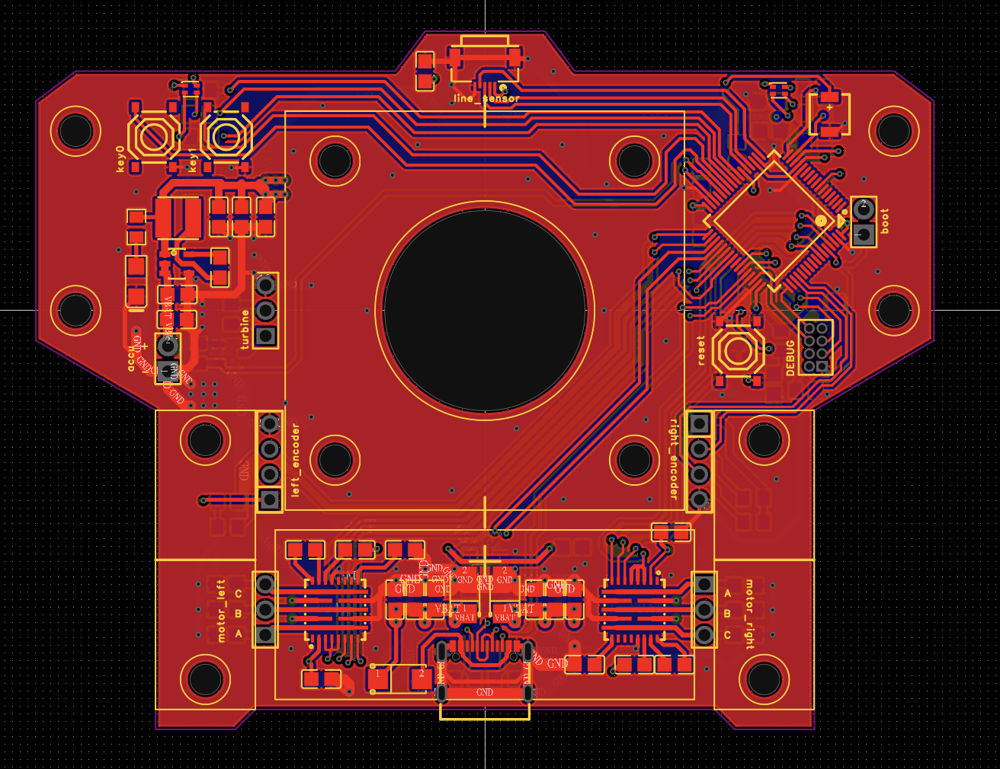
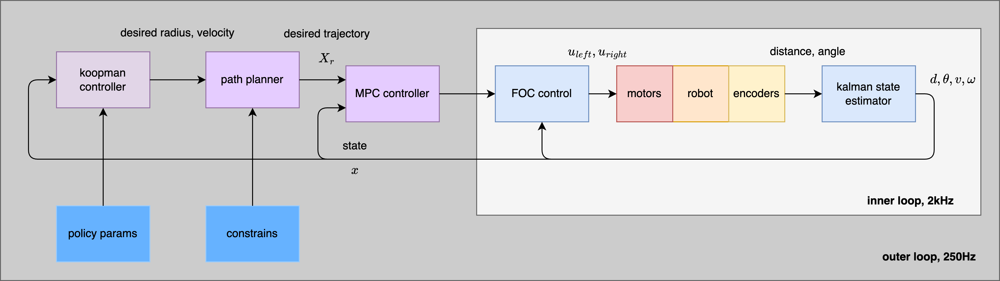

# motoko cryo drake - line following robot

robot photos

# hardware

- main MCU stm32f722, cortex m7, 216MHz, FPU
- sensors MCU stm32g031, cortex m0, 64MHz
- BLDC motors, custom windings, custom silicone tires
- 3 phase drivers, 2 x MP6541, 8A drivers
- turbine - some random DC drone motor + 3D print
- line sensors : 10x phototransistor + white LED
- obstacle sensors : 4x IR photo diode
- power 2D LiPo, Dualsky 250mAh
- USB C, debug connectors, RGB leds

# robot PCB

4 layer pcb, designed in EasyEDA

# software 

inner loop, 2kHz : 
- FOC control for BLDC motors
- kalman filter state estimator

outer loop
- analytical MPC
- constrained path planner
- koopman operator non linear controller

# block diagram

